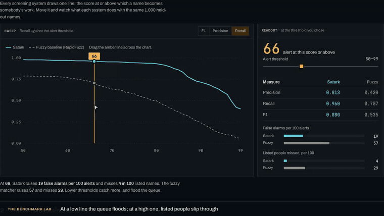
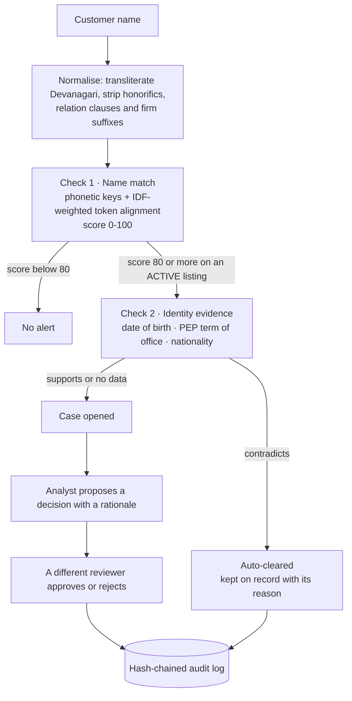
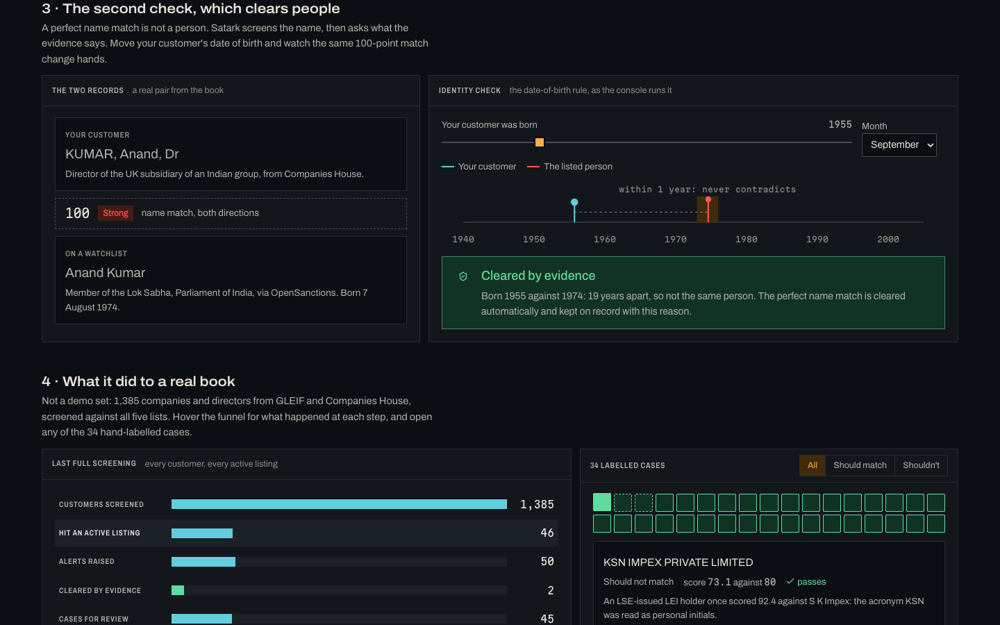
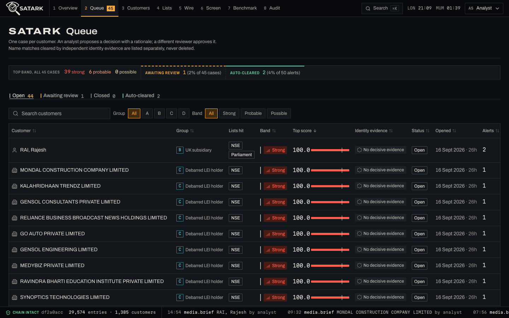
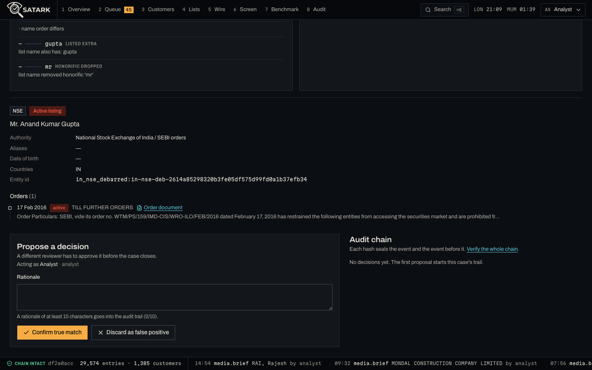
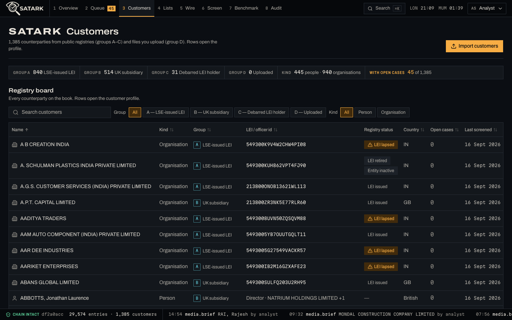
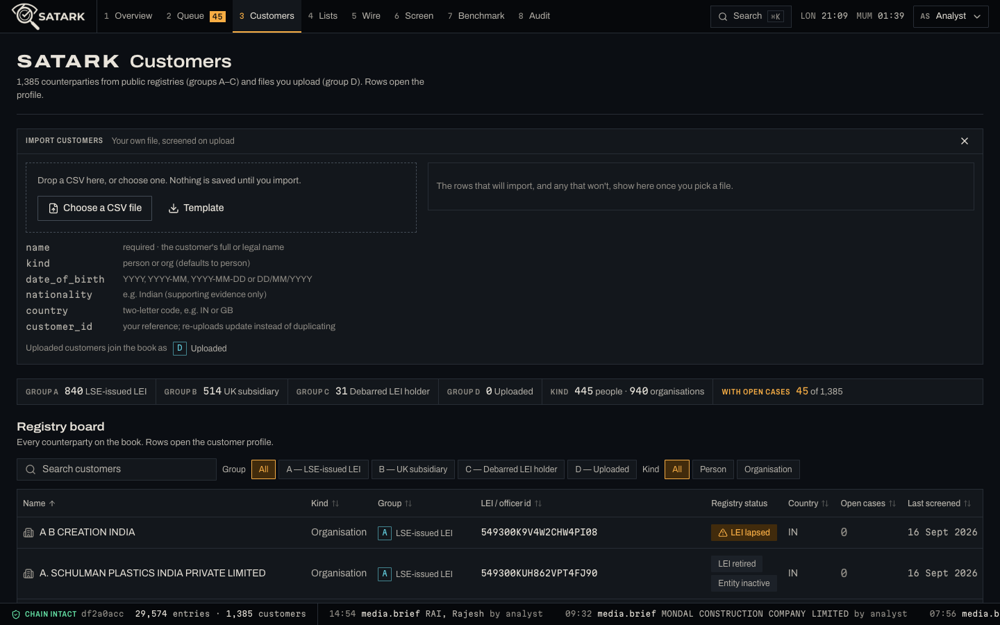
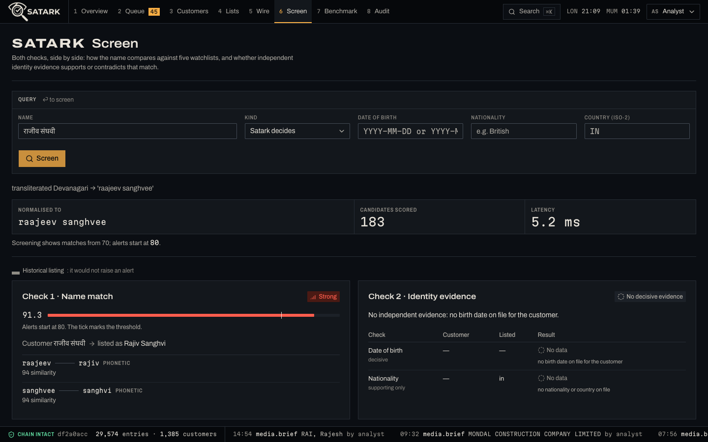
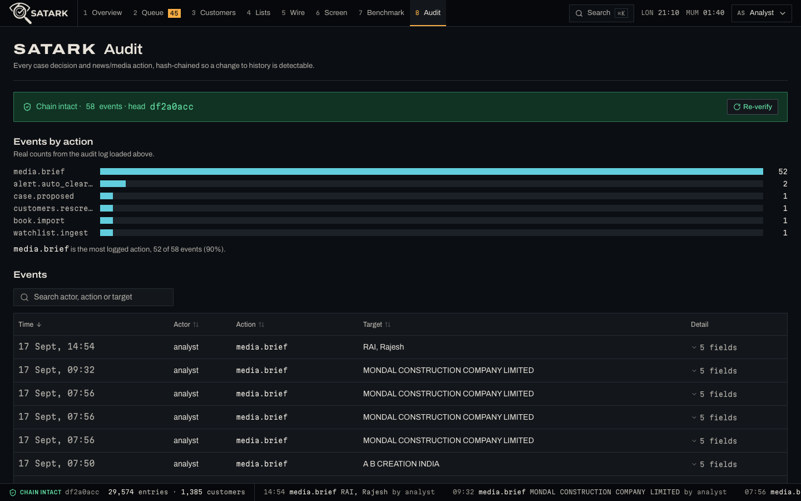
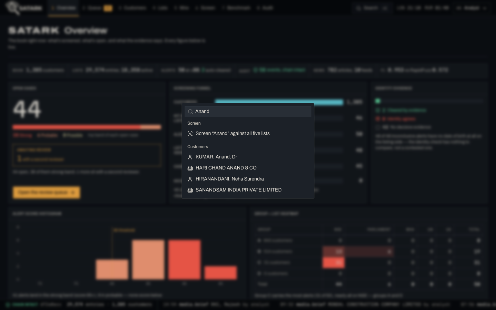

# Satark · सतर्क

**Counterparty screening for India-linked companies and the people behind them, on real public data.**

Satark screens a real customer book against five official watchlists, and it never trusts a name on its own. Every hit gets two separate checks: a **name match**, and an independent **identity check** that can confirm the match or clear it. Analysts work the resulting cases under a four-eyes rule. Every decision lands in a hash-chained audit log.

> Potential matches are leads for a human reviewer, never findings. This is an independent portfolio project. It is not affiliated with any exchange, regulator or data vendor. Watchlist data © [OpenSanctions](https://www.opensanctions.org) (CC BY-NC 4.0).

---

## Watch it run

[](docs/demo/satark-highlight.mp4)

**▶ [The 45-second cut](docs/demo/satark-highlight.mp4)** — the threshold drag, the identity check clearing a perfect name match, a live screen, the four-eyes refusal and approval, and the audit chain.
**▶ [The full 4-minute walkthrough](docs/demo/satark-walkthrough.mp4)** — the benchmark lab, then all eight console screens.

Both play in the browser, with sound and captions. The walkthrough covers a case decided under the four-eyes rule, a CSV imported and screened live, reverse screening from a listing back into the book, and the audit chain re-verified with the new decision in it. The run is against a copy of the database, so the decision and the import in the video are real writes, not mock-ups. [Every beat as a still.](docs/demo/)

---

## What is real here

| | Source | Size |
|---|---|---|
| **Watchlists** | OpenSanctions full exports: NSE/SEBI debarments, Parliament of India, MHA UAPA bans, UN Security Council, UK Sanctions List | **29,574 entries**, 18,358 active · 11,216 historical orders that never alert |
| **Customer book** | **A** 840 Indian entities whose LEIs are issued by London Stock Exchange LEI Ltd (GLEIF) · **B** 114 UK subsidiaries of Indian groups with their 400 current directors (GLEIF Golden Copy + Companies House) · **C** 31 companies on NSE's active debarment list that hold an LEI · **D** your own CSV, imported in the console | **1,385 customers** + uploads |
| **News** | A local full-text index of 10 regulator and publisher feeds: SEBI, RBI, FCA, NCA, The Hindu, BusinessLine, Indian Express, Mint, Times of India, NDTV Profit | 782 articles indexed, searched locally |

Nothing in the book is invented. The old synthetic book survives only as `satark seed --synthetic`, next to the benchmark.

Director records are personal data, so the 400 Companies House officer rows stay in `data/cache/` and are never committed. A fresh clone seeds **985 customers**: 840 in group A, the 114 group B companies, and 31 in group C. `make book` with a free Companies House key rebuilds the directors and takes the book to 1,385. Every figure on this page is from the full book.

## How a hit is judged



- **Check 1 is a pure name score.** It transliterates Devanagari with schwa deletion, strips honorifics, relation clauses (S/O, D/O) and firm suffixes, applies an Indic phonetic key, and aligns tokens with IDF weights. Every score carries its reasons in plain English.
- **Check 2 compares independent attributes** and reports each one as *supports*, *contradicts*, *neutral* or *no data*. A birth-year gap of two years or more clears the match. A month slip or a one-year gap stays neutral. Conflicting strong evidence goes to a person. A clearance is re-evaluated when the listing changes.
- **Only active listings alert.** An order is revoked or expired per its own text. A politician stays a PEP for 12 months after leaving office (FCA FG17/6).
- **Maker-checker:** the person who proposes a decision cannot approve it.
- **Audit:** events chain with `sha256(prev, actor, action, target, detail, time)`. A compare-and-set on the head stops concurrent writers forking the chain. `GET /audit/verify` names the first tampered event.

Full detail, with the data model and every module: **[docs/ARCHITECTURE.md](docs/ARCHITECTURE.md)**.

## Results on the real book

`satark seed` loads everything and screens all 1,385 customers in about 8 seconds.

| Group | Customers | Outcome |
|---|---:|---|
| A · LSE-issued LEIs | 840 | **0 alerts** |
| B · UK subsidiaries and directors | 514 | **17 open alerts** on 14 directors, all common-name collisions against listings with no date of birth · **2 auto-cleared** by date of birth |
| C · debarred LEI holders | 31 | **31 of 31** alert on their own listing |

Two findings fell out of the same run:

- **26 of the 114 UK subsidiaries carry a registry mismatch.** GLEIF names an Indian parent, and Companies House lists no person with significant control. ICICI Bank UK PLC is one of them.
- **13 of the 31 debarred companies have let their LEI lapse.**

### What real data taught the matcher

The matcher scored F1 0.94 on synthetic variants. Real customers still found five defects. A regression test now covers each one.

1. **Company acronyms read as a person's initials.** "KSN IMPEX PRIVATE LIMITED" scored 92.4 against "S K Impex".
2. **Short names one edit apart.** Director "SINGH, Ankit" scored 90.3 against MP "Shrimati Anita Singh".
3. **A hidden active listing.** Alerting kept the top 5 matches *before* dropping historical ones, so an active listing could hide behind revoked namesakes.
4. **Silent suppression.** The date of birth was folded into the name score, so a contradiction dropped the alert without anyone seeing why. It is a separate, visible check now.
5. **One director, several customers.** A director of two subsidiaries was screened twice. Directors merge by Companies House officer id now.

`data/eval/real_cases.csv` holds 34 labelled real pairs, and CI fails if any of them regresses. The same gate fails 0 of 2 on the pre-fix normaliser.

## Benchmark

`satark eval` builds 2,000 queries from real list names: 1,000 positives rewritten ten ways, and 1,000 negatives. Thresholds are chosen on a dev half. Everything below comes from the held-out test half.

| System | Threshold | Precision | Recall | F1 | Unlisted people flagged |
|---|---:|---:|---:|---:|---:|
| **Satark** | 77 | **0.965** | **0.940** | **0.953** | **3.4%** |
| Satark at the shipping threshold | 80 | 0.975 | 0.932 | 0.953 | |
| RapidFuzz `token_sort_ratio` | 79 | 0.668 | 0.501 | 0.572 | 25.1% |
| Exact match on normalised names | 100 | 1.000 | 0.002 | 0.004 | 0.0% |

| Query type | Satark recall | RapidFuzz recall |
|---|---:|---:|
| Devanagari script | 100% | 2% |
| S/O · D/O clause | 100% | 0% |
| Initials | 91% | 13% |
| Middle name dropped | 100% | 24% |
| Several transforms at once | 81% | 55% |
| Typo | 70% | 85% |

**RapidFuzz wins on typos**, because Satark only accepts close phonetic keys, and loosening that costs precision. The variant queries are generated, and the Devanagari ones come from this repo's own generator, so treat the script row as optimistic. Median matcher latency is 1.9 ms against 44,220 indexed names.

Method, the full threshold sweep, the 34 real cases and how to re-run all of it: **[docs/BENCHMARKS.md](docs/BENCHMARKS.md)**.

---

## The front page

One static page on the console's own graphite ground. A translucent figure is keyed onto the dark background with a WebGL shader. "Let's get started" hands over to the console with a cross-document view transition.


Below it sits **the benchmark lab**: the accuracy claims above, as four experiments the visitor runs.


Drag the alert line and both systems move. Pick any of the ten name transforms. Move one date of birth until the evidence clears a perfect name match. Open any of the 34 labelled cases. Then screen a name of your own against the live API.



## The console

Eight screens, one job each. Press a screen's number key to jump to it, or ⌘K from anywhere.


*Overview — what is screened, what is open, and what the evidence said. Every figure is live.*


*Queue — every case waiting for a decision, strongest match first, with the identity verdict on each row.*


*Case file — check 1 draws the token alignment as leader lines, check 2 shows each attribute as supports, contradicts or no data.*


*The four-eyes rule — an analyst proposes with a rationale, and a different reviewer approves. Both events hash into the chain on the right.*


*Customers — 1,385 counterparties with group, kind and registry status. Rows open the profile with its ownership diagram.*


*Import — a dry run first: bad rows are rejected by line and reason. Valid rows join the book as group D and are screened on upload.*


*Lists — search all 29,574 listings, then see who in your own book each listing touches, with the identity check on every hit.*


*Wire — regulator orders and business press as a front page, with a lead story, a keyword-tagged risk desk, and coverage analytics.*


*Screen — any name, any script. Devanagari in, a debarred NSE entity out, with the score explained.*


*Benchmark — the measurements on this page, re-run in the console against the fuzzy baseline.*


*Audit — every decision in a hash chain you can verify in one click.*


*⌘K — find a customer, screen any name, import a file, or jump to a screen.*

The console is styled as a trade-surveillance terminal: graphite panels, one meaning per colour (amber for attention, cyan for navigation, red to sand for match risk, green for cleared, violet for regulators), Archivo for words and Martian Mono for figures, numbered function tabs, and a status tape carrying the audit chain along the bottom. The whole system is recorded in **[DESIGN.md](DESIGN.md)**.

---

## Repository layout

```
satark/
├── backend/satark/          the whole service, one module per job
│   ├── api.py               FastAPI routes: screen, cases, customers, entities, news, audit
│   ├── service.py           the use cases behind the routes
│   ├── matcher.py           the name matcher and its in-memory index
│   ├── normalize.py         Devanagari transliteration, honorifics, relation clauses, suffixes
│   ├── secondary.py         the identity check and its rules
│   ├── models.py            SQLAlchemy tables
│   ├── sources.py           the five watchlists and the customer book loaders
│   ├── upload.py            CSV import: parsing, rejects, group D
│   ├── evaluation.py        the benchmark: query generation, sweeps, gates
│   ├── news/                feed polling, the FTS5 index, the grounded media brief
│   └── mcp_server.py        the MCP tools
├── backend/tests/           122 tests, including the real-case gate
├── frontend/
│   ├── index.html           the static front page
│   ├── landing/             the benchmark lab: lab.css, lab.js
│   ├── app/                 the console entry point
│   └── src/                 React 19: pages, components, lib
├── data/
│   ├── snapshots/           committed list and book snapshots, so a clone can seed offline
│   ├── eval/real_cases.csv  the 34 labelled real pairs
│   └── cache/               director personal data, gitignored, never committed
├── docs/
│   ├── ARCHITECTURE.md      the system, the pipeline, the data model, the folders
│   ├── BENCHMARKS.md        method, numbers, and how to reproduce them
│   ├── CHANGELOG.md         what changed, newest first
│   ├── build-log.md         every step with its measurements
│   ├── demo/                the walkthrough video and 52 stills
│   └── screens/             the screenshots in this README
├── DESIGN.md                the Surveillance Terminal design system
├── PRODUCT.md               what the product is and who it is for
└── docker-compose.yml       api, worker, Postgres, Redis, nginx
```

## Run it

Needs Python 3.11+ and Node 20.19+.

```bash
make install     # venv, backend and frontend dependencies
make seed        # load the five lists and the real book, then screen everyone
make api         # http://127.0.0.1:8000/docs
make web         # http://localhost:5173 (front page) · http://localhost:5173/app/ (console)
make news        # poll the ten feeds into the local index
make test        # the backend test suite
make eval        # the benchmark and its quality gate
make eval-real   # the 34 real labelled cases
```

The watchlists and the companies are committed, so `make seed` needs no network and no keys. It loads 985 customers. To add the 400 directors, put a free Companies House key in `.env` as `SATARK_COMPANIES_HOUSE_KEY` and run `make book`, which re-fetches GLEIF and Companies House and takes the book to 1,385.

To screen your own customers, open **Satark Customers → Import customers**, or `POST /customers/import` with `{"csv": "...", "dry_run": true}` first. Columns are `name` (required), `kind`, `date_of_birth`, `nationality`, `country` and `customer_id`. `GET /customers/import/template` returns a sample file. Re-uploading a `customer_id` updates that customer instead of duplicating it.

The full stack runs with `docker compose up --build -d`, then `docker compose exec api satark seed`.

## MCP server

`make mcp-config` prints a Claude Desktop config block. The tools are `screen_entity`, `explain_match`, `get_record`, `adverse_media_brief` and `list_open_alerts`.

## Limits, stated plainly

- **No real authentication.** Maker-checker identities are a demo header with fixed roles.
- **Identifier matching is not built.** Across the whole book there are 0 comparable identifier pairs: NSE listings carry PANs, and GLEIF companies carry CINs.
- **Most director alerts need a person.** The matched NSE and Parliament entries carry no date of birth, so the identity check has nothing to compare.
- **News history starts at the first poll.** RSS carries only recent items. PIB and Business Standard are excluded because they answer only a spoofed browser.
- **The data licence is non-commercial.** OpenSanctions data is CC BY-NC: fine for a portfolio, not for resale.

## Stack

Python 3.12 · FastAPI · SQLAlchemy 2 · SQLite and PostgreSQL · Redis Streams · RapidFuzz · LangGraph · SQLite FTS5 · MCP · Prometheus · React 19 · TypeScript · Vite, multi-page with cross-document view transitions · Tailwind v4 · shadcn/ui · TanStack Query and Table · Recharts · GitHub Actions · pytest

**Documentation:** [ARCHITECTURE](docs/ARCHITECTURE.md) · [BENCHMARKS](docs/BENCHMARKS.md) · [CHANGELOG](docs/CHANGELOG.md) · [build log](docs/build-log.md) · [DESIGN](DESIGN.md) · [PRODUCT](PRODUCT.md) · [walkthrough](docs/demo/)
