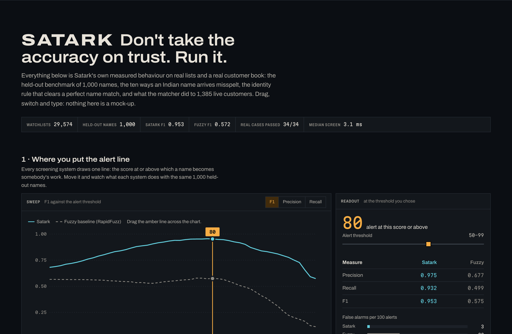
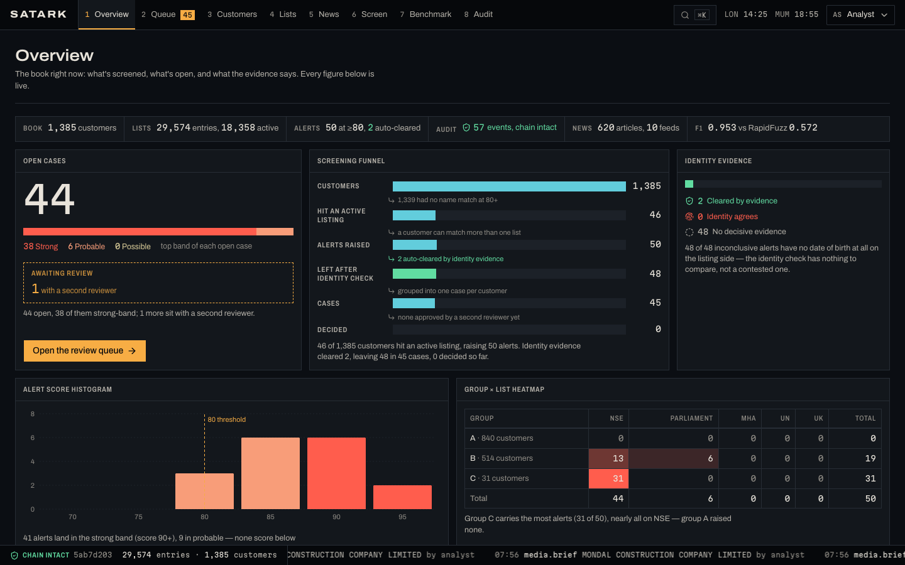
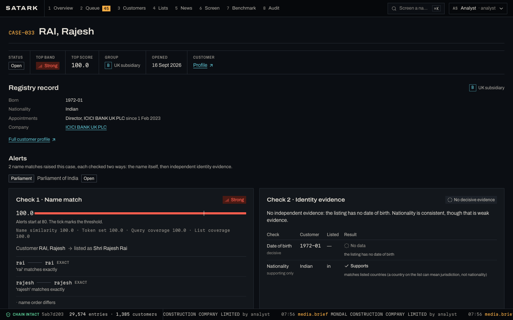
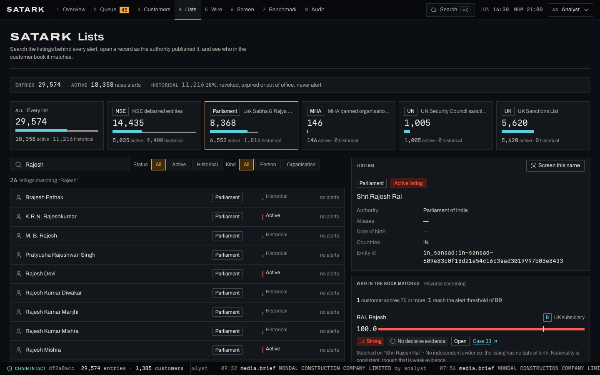
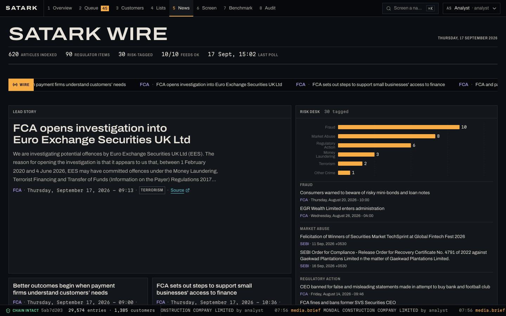

# Satark · सतर्क

**Counterparty screening for India-linked companies and the people behind them, on real public data.**

Satark screens a real customer book against five official watchlists and never trusts a name on its own. Every hit gets two separate checks: a **name match**, and an independent **identity check** that can confirm it or clear it. Reviewers work the resulting cases under a four-eyes rule, and every decision lands in a hash-chained audit log.

> Potential matches are leads for a human reviewer, never findings. An independent portfolio project, not affiliated with any exchange, regulator or data vendor. Watchlist data © [OpenSanctions](https://www.opensanctions.org) (CC BY-NC 4.0).


Below the front page is **the benchmark lab**: the accuracy claims above, as four experiments you run yourself.



---

## What is real here

| | Source | Size |
|---|---|---|
| **Watchlists** | OpenSanctions full exports of NSE/SEBI debarments, Parliament of India, MHA UAPA bans, UN Security Council, UK Sanctions List | 29,574 entries; 9,400 NSE entries are *historical* (revoked or expired orders) and don't alert |
| **Customer book** | **A**: the 840 Indian entities whose LEIs are issued by London Stock Exchange LEI Ltd (GLEIF) · **B**: 114 UK subsidiaries of Indian groups with their 400 current directors (GLEIF Golden Copy + Companies House) · **C**: 31 companies on NSE's active debarment list that hold an LEI · **D**: your own CSV, uploaded in the console and screened on import | 1,385 customers + uploads |
| **News** | An owned full-text index of 10 regulator and publisher feeds (SEBI, RBI, FCA, NCA, The Hindu, BusinessLine, Indian Express, Mint, Times of India, NDTV Profit) | searched locally, no call limits |

Nothing in the book is synthetic. The old Faker book survives only as `satark seed --synthetic`, next to the benchmark.

## Results on the real book

`satark seed` loads everything and screens all 1,385 customers in about 8 seconds:

| Group | Customers | Outcome |
|---|---:|---|
| A · LSE-issued LEIs | 840 | **0 alerts** |
| B · UK subsidiaries + directors | 514 | **17 open alerts** on 14 directors (common-name collisions against listings with no date of birth) · **2 auto-cleared** by date of birth |
| C · debarred LEI holders | 31 | **31 of 31** alert on their own listing |

Also found along the way:
- **26 of the 114 UK subsidiaries have a registry mismatch.** GLEIF names an Indian parent, but Companies House lists no person with significant control. ICICI Bank UK PLC is one of them.
- **13 of the 31 debarred companies have let their LEI lapse.**

## How a hit is judged

```
customer ──► Check 1 · Name match ──────────► score ≥ 80 on an ACTIVE listing?
             (Indian-name normaliser,             │
              phonetic keys, IDF-weighted          ▼
              token alignment)               Check 2 · Identity evidence
                                             date of birth (decisive) · PEP term age (decisive)
                                             nationality (supporting only)
                                                   │
                     contradicted ◄────────────────┼────────────► confirmed / inconclusive
                     auto-cleared, kept visible,   │              case opened for review
                     audited                       ▼
                                  analyst proposes ─► a different reviewer approves
                                  (hash-chained audit log, verifiable)
```

- **Name match** is a pure name score. It uses Hindi-aware Devanagari transliteration with schwa deletion, strips honorifics, relation clauses (S/O, D/O) and firm suffixes, applies an Indic phonetic key, and aligns tokens with IDF weights. Every score comes with plain-English reasons.
- **Identity evidence** compares independent attributes and shows each check as *supports*, *contradicts*, *neutral* or *no data*.
  - A birth-year gap of two or more years clears the match.
  - A month slip or a one-year gap is neutral.
  - Conflicting strong evidence goes to a human.
  - A clearance is re-evaluated when the listing changes.
- **Only active listings alert.** An order is revoked or expired per its own text. A politician stays a PEP for 12 months after leaving office (FCA FG17/6).
- **Maker-checker:** the person who proposes a decision can't approve it.
- **Audit:** events chain with `sha256(prev, actor, action, target, detail, time)`, and a compare-and-set on the head means concurrent writers can't fork the chain. `GET /audit/verify` names the first tampered event.

## What real data taught the matcher

The matcher scored F1 0.94 on synthetic variants. Real customers still found five defects, each now covered by a regression test:

1. **Company acronyms read as a person's initials.** "KSN IMPEX PRIVATE LIMITED" scored 92.4 against "S K Impex".
2. **Short names one edit apart.** Director "SINGH, Ankit" scored 90.3 against MP "Shrimati Anita Singh".
3. **A hidden active listing.** Alerting kept only the top 5 matches *before* dropping historical ones, so a common name's active listing could hide behind its revoked namesakes.
4. **Silent suppression.** Date of birth was folded into the name score, so a contradiction dropped the alert without anyone seeing why. It's now a separate, visible check.
5. **One director, several customers.** A director of two subsidiaries was screened twice. Directors are now merged by Companies House officer id.

`data/eval/real_cases.csv` holds 34 labelled real pairs, and CI fails if any regresses. The gate fails 0/2 on the pre-fix normaliser.

Every step with its measurements: **[docs/build-log.md](docs/build-log.md)**.

## Benchmark

`satark eval` builds 2,000 queries from real list names: 1,000 positives rewritten ten ways and 1,000 negatives. Thresholds are picked on a dev half; everything below is from the held-out test half.

| System | Threshold | Precision | Recall | F1 | Unlisted people flagged |
|---|---:|---:|---:|---:|---:|
| **Satark** | 77 | **0.965** | **0.940** | **0.953** | **3.4%** |
| Satark at the production threshold | 80 | 0.975 | 0.932 | 0.953 | |
| RapidFuzz `token_sort_ratio` | 79 | 0.668 | 0.501 | 0.572 | 25.1% |
| Exact (normalised) | 100 | 1.000 | 0.002 | 0.004 | 0.0% |

| Query type | Satark recall | RapidFuzz recall |
|---|---:|---:|
| Devanagari script | 100% | 2% |
| S/O · D/O clause | 100% | 0% |
| Initials | 91% | 13% |
| Middle name dropped | 100% | 24% |
| Typo | 70% | 85% |

RapidFuzz wins on typos because Satark only accepts close phonetic keys; loosening that costs precision. The variants are synthetic, and the Devanagari ones come from this repo's own generator, so treat the script results as optimistic. Median screening latency is 1.9 ms against 44,220 indexed names.

## The console

The console is styled as a trade-surveillance terminal:
- graphite panels, with flat colour where each hue means one thing (amber for attention, cyan for navigation, red to sand for match risk, green for cleared, violet for regulators);
- Archivo for words and Martian Mono for figures;
- numbered function tabs (keys 1–8);
- a status tape running the audit chain along the bottom.

The design system is recorded in [DESIGN.md](DESIGN.md).









| Screen | What it does |
|---|---|
| **Landing** `/` | One static page on the console's graphite: a translucent figure scrubbed by mouse travel, keyed onto the dark ground with a WebGL shader, and "Let's get started", which hands over to the console with a view transition. Below it, **the benchmark lab**: drag the alert threshold across the sweep, pick any of the ten name transforms, move a date of birth until the evidence clears a perfect name match, open any of the 34 labelled cases, then screen a name of your own against the live API |
| **Overview** | A monitor wall: live counts, open cases by band, a screening funnel that explains each step, identity-evidence verdicts, the alert score histogram, a customer-group × list heatmap, the watchlist board, matching quality and news pulse |
| **Review queue** | Cases by status with band, score against the threshold, identity verdict and lists hit; state in line form; auto-cleared alerts with the evidence that cleared them |
| **Case file** | Name match (token alignment drawn as leader lines) and identity evidence side by side, the listing, registry context, maker-checker actions that say why they're blocked, the case's audit chain |
| **Customers** | All 1,385 with group, kind and registry status; profiles with an ownership diagram, the GLEIF-vs-PSC mismatch, directors and cases. **Import customers** checks your own CSV row by row (rejects with line and reason), then adds the valid rows as group D and screens them |
| **Lists** | Search all 29,574 listings by name, list, status and kind; open a record as the authority published it; **reverse screening** shows who in the book the listing matches, with the identity check and any open case |
| **Wire** (news) | A wire-service front page: a lead story, a keyword-tagged risk desk, regulator and press desks, coverage analytics, and a name dossier that shows each event inside its source with four grounding checks |
| **Screen · Benchmark · Audit** | Screen any name through both checks; threshold sweeps and the 34 real cases; chain verification and events by action |
| **⌘K** | The command menu: find a customer, screen any name, import a file, or jump to a screen |

## Run it

Needs Python 3.11+ and Node 20.19+.

```bash
make install     # venv + backend + frontend deps
make seed        # load the five lists and the real customer book, screen everyone
make api         # http://127.0.0.1:8000/docs
make web         # http://localhost:5173 (landing) · http://localhost:5173/app/ (console)
make news        # poll the ten feeds into the local index
make test        # backend test suite
make eval        # synthetic benchmark + quality gate
make eval-real   # the 34 real labelled cases
```

Rebuilding the customer book from source is optional: the committed snapshots are enough. `make book` re-fetches GLEIF, and for group B it needs a free Companies House key in `.env` as `SATARK_COMPANIES_HOUSE_KEY`. Director details are personal data, so they're cached locally in `data/cache/` and never committed.

To screen your own customers, open **Satark Customers → Import customers**, or `POST /customers/import` with `{"csv": "...", "dry_run": true}` first. Columns are `name` (required), `kind`, `date_of_birth`, `nationality`, `country`, `customer_id`; `GET /customers/import/template` returns a sample file. Re-uploading a `customer_id` updates that customer rather than duplicating it.

The full stack (Postgres, Redis Streams worker, nginx) runs with `docker compose up --build -d`, then `docker compose exec api satark seed`.

## MCP server

`make mcp-config` prints a Claude Desktop config block. Tools:

- `screen_entity` returns both checks per match
- `explain_match`
- `get_record`
- `adverse_media_brief`
- `list_open_alerts`

## Limits, stated plainly

- **No real authentication.** Maker-checker identities are a demo header with fixed roles.
- **Identifier matching is not built.** Across the whole book there are 0 comparable identifier pairs: NSE listings carry PANs, while GLEIF companies carry CINs.
- **Most director alerts need a human.** The matched NSE and Parliament entries have no date of birth.
- **News history starts at the first poll.** RSS carries only recent items. PIB and Business Standard are excluded because they only answer a spoofed browser.
- **Non-commercial data licence.** OpenSanctions data is CC BY-NC, fine for a portfolio and not for resale.

## Stack

Python 3.12 · FastAPI · SQLAlchemy 2 · SQLite / PostgreSQL · Redis Streams · RapidFuzz · LangGraph · SQLite FTS5 · MCP · Prometheus · React 19 · TypeScript · Vite (multi-page, cross-document view transitions) · Tailwind v4 · shadcn/ui · TanStack Query & Table · Recharts · GitHub Actions · pytest
