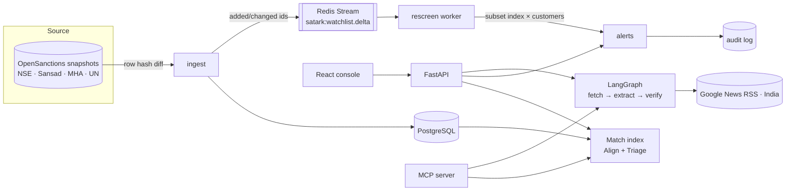

# Satark · सतर्क

**India-first KYC screening.** Satark matches customers against Indian and UN watchlists, handles the ways Indian names get written (Devanagari, honorifics, initials, S/O clauses, *-bhai* suffixes, Md./Kr. abbreviations), rescreens the customer book when a list changes, reads news for adverse media with grounding checks, and exposes all of it to AI assistants over MCP.

On a 2,000-query benchmark built from real list names, Satark reaches **F1 0.942** (precision 0.976, recall 0.910). Plain RapidFuzz fuzzy matching reaches **0.573** and exact matching **0.012**. In the benchmark run, median screening latency was 5.7 ms against ~30,000 indexed names.

> Potential matches are leads for a human reviewer, never findings. Watchlist data © [OpenSanctions](https://www.opensanctions.org), CC BY-NC 4.0. Independent portfolio project, not affiliated with any exchange or data vendor.

---

## The name is the architecture

| | Layer | What it does | Code |
|---|---|---|---|
| **S** | Source | Loads NSE debarred entities, Parliament members (PEPs), MHA banned organisations and UN sanctions. Hashes each row and publishes added or changed ids as a delta event | `sources.py`, `service.ingest` |
| **A** | Align | Hindi-aware Devanagari → Latin transliteration with schwa deletion, honorific and relation-clause removal, initials, firm suffixes (Pvt, Ltd, HUF), an Indic phonetic key | `names.py` |
| **T** | Triage | Inverted index on phonetic keys, fuzzy vocabulary expansion, IDF-weighted token alignment, entity-type and birth-year checks, plain-English reasons for every score | `matcher.py` |
| **A** | Adverse media | LangGraph agent: fetch Indian news → extract events (Claude or keyword rules) → verify each quote and subject against the source | `media/` |
| **R** | Review | Alert queue with confirm, discard and escalate, a full audit trail, and event-driven rescreening over Redis Streams | `service.py`, `events.py` |
| **K** | Knowledge | REST API, MCP server for Claude Desktop and other MCP clients, Prometheus metrics, React analyst console | `api.py`, `mcp_server.py`, `frontend/` |



## Quick start

Needs Python 3.11+ and Node 20.19+. On macOS: `brew install python@3.12 node`, then pass `PY=python3.12` to `make install` if `python3` is older.

### Option 1 · local, no Docker (SQLite + in-process events)

```bash
make install          # venv, backend + dev deps, frontend deps
make seed             # loads ~24k list entities, 1,000 synthetic customers, screens them
make api              # http://127.0.0.1:8000/docs
make web              # http://localhost:5173  (second terminal)
```

### Option 2 · full stack (Postgres + Redis + worker + nginx)

```bash
docker compose up --build -d
docker compose exec api satark seed
open http://localhost:5173
docker compose --profile observability up -d prometheus   # optional, http://localhost:9090
```

Set `ANTHROPIC_API_KEY` in `.env` (or your shell) to switch adverse-media extraction from keyword rules to Claude.

### 90-second demo

1. **Screen** → click `श्री राजीव संघवी`. The pipeline strip shows the transliteration and honorific removal. The top hit is the NSE listing *Mr. Rajiv Ramniklal Sanghvi* with phonetic token pairs.
2. **Monitoring** → *Published in Devanagari* → **Publish listing**. A synthetic listing of an existing customer goes out in Devanagari. The worker picks up the delta and opens an alert within seconds.
3. **Review queue** → open that alert, read why it matched, escalate it with a note. Check **Audit trail**.
4. **Adverse media** → build a brief. Look at the grounding checks, including the event that fails them.
5. **Benchmark** → per-query-type results against both baselines.

## Benchmark

`satark eval` builds 2,000 queries from the live list snapshot:

- **1,000 positives.** Real list names rewritten ten ways: honorific, initials, reordering, dropped middle name, spelling variant, typo, Devanagari script, S/O-D/O clause, Md./Kr./Pd. abbreviation, and two changes combined.
- **1,000 negatives.** Random Faker `en_IN` people, plus hard negatives that keep a listed person's first name and swap the surname. Both kinds are filtered so they are not on any list.

Each system gets its own threshold, chosen by best F1 on a dev half. Everything below comes from the held-out test half (`reports/eval.json`).

| System | Threshold | Precision | Recall | F1 | Unlisted people flagged | Top-1 |
|---|---:|---:|---:|---:|---:|---:|
| **Satark** | 80 | **0.976** | **0.910** | **0.942** | **2.2%** | **0.848** |
| RapidFuzz `token_sort_ratio` | 79 | 0.669 | 0.501 | 0.573 | 24.9% | 0.463 |
| Exact (normalised) | 100 | 1.000 | 0.006 | 0.012 | 0.0% | 0.006 |

| Query type | Satark | RapidFuzz |
|---|---:|---:|
| Devanagari script | 96% | 4% |
| S/O · D/O clause | 98% | 0% |
| Initials | 85% | 11% |
| Middle name dropped | 96% | 29% |
| Honorific | 100% | 88% |
| Typo | 80% | 89% |
| Two changes combined | 62% | 53% |
| Hard negative (same first name) | 97% correct | 65% correct |

CI runs `satark eval --gate` and fails the build if precision drops below 0.93, recall below 0.90 or F1 below 0.92.

**Limits of this benchmark.** The variants are synthetic, and the Devanagari variants come from this repo's own Latin → Devanagari generator, so script results are optimistic. RapidFuzz beats Satark on typos because Satark only accepts a spelling variant when the phonetic keys are very close (same first sound, Jaro-Winkler ≥ 0.88, edit ratio ≥ 0.84). Looser rules would cost precision. Initials-only queries such as *S. Singh* are ambiguous by nature. The next step is a hand-labelled set of real Indian name pairs.

## MCP server

```bash
make mcp-config    # prints a Claude Desktop config block with your absolute path
```

Paste the block into `~/Library/Application Support/Claude/claude_desktop_config.json` and restart Claude Desktop. Tools:

| Tool | Returns |
|---|---|
| `screen_entity(name, kind?, birth_date?, country?)` | Potential matches with score, band and reasons |
| `explain_match(name, entity_id)` | Token-by-token comparison and score components |
| `get_record(entity_id)` | Full list record: authority, programme, aliases, dates |
| `adverse_media_brief(subject)` | Grounded news events with URLs and verbatim quotes |
| `list_open_alerts(limit)` | Newest open alerts in the review queue |

Try asking: *"Screen राजीव संघवी and explain the top match."*

## API

| Method | Path | |
|---|---|---|
| POST | `/screen` | Screen a name |
| GET | `/entities/{id}` | Watchlist record |
| GET · POST | `/customers` | List customers · onboard and screen one |
| POST | `/customers/rescreen` | Rescreen the whole book |
| GET | `/alerts?status=open` | Review queue |
| POST | `/alerts/{id}/decision` | `confirmed` · `discarded` · `escalated` |
| GET | `/watchlists` | Source counts and last ingest |
| POST | `/watchlists/refresh?mode=remote` | Pull the latest lists and publish deltas |
| POST | `/watchlists/simulate-delta` | Publish a synthetic listing of a customer |
| POST | `/media/brief` | Adverse-media brief |
| GET | `/audit` · `/eval` · `/metrics` · `/stats` | Audit log, benchmark report, Prometheus, summary |

## Commands

```
satark ingest [--remote] [--update-snapshot] [--custom file.csv --key my_list]
satark seed [--customers 1000]
satark eval [--gate]
satark serve [--workers 4]
satark worker [--metrics-port 9101]
satark rescreen
satark mcp
make test · make load (Locust, 50 users, 60 s)
```

`--custom` loads any CSV with a `name` column plus optional `aliases` (`;`-separated), `schema`, `birth_date`, `countries`. Use it for lists you are licensed to use, such as the RBI Alert List of unauthorised forex platforms converted to CSV. See `data/custom_list.example.csv`.

## Design notes

- **Why a custom transliterator instead of a library.** Scheme converters such as ITRANS keep the inherent vowel, so `कुमार` becomes *kumaara*. Hindi drops final and many medial schwas when names are spoken and romanised. `devanagari_to_latin` applies word-final and VC_CV schwa deletion, keeps the vowel after conjuncts (`राजेंद्र` → *raajendra*), and maps anusvara to *n* or *m* by the following consonant.
- **Why IDF-weighted alignment.** *Kumar*, *Singh* and *Devi* carry almost no identity, and surnames carry a lot. Middle tokens get 0.6 weight because Indian records often drop them.
- **Why deltas instead of nightly batch.** The worker scores customers only against a subset index of the changed entities. A delta against 1,000 customers finishes in about a second, most of it spent reloading the index. The subset reuses the global IDF stats, so scores stay comparable with onboarding screens.
- **Grounding over trust.** An adverse-media event is only marked *grounded* if its quote appears verbatim in the source and the subject's name tokens appear there too. The keyword extractor shows why this matters: it attributes a lawyer's arrest to his client, and the check catches it.
- **Privacy.** Identifier columns such as PAN are dropped at ingest and never stored or shown.

## Stack

Python 3.12 · FastAPI · SQLAlchemy 2 · PostgreSQL / SQLite · Redis Streams · RapidFuzz · LangGraph · Anthropic API · MCP Python SDK · Prometheus client · React 19 · TypeScript · Vite · Docker Compose · GitHub Actions · pytest · Locust
