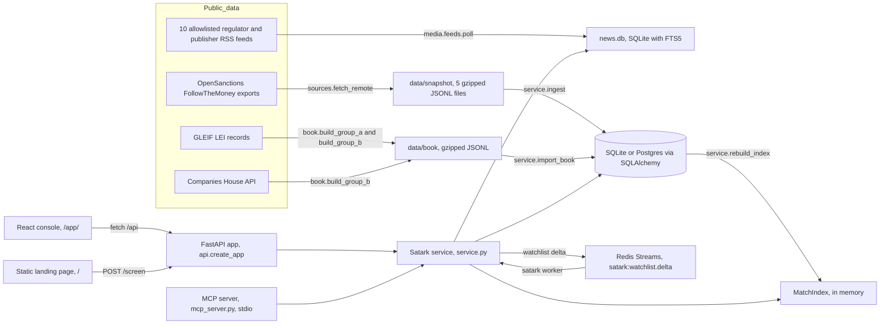
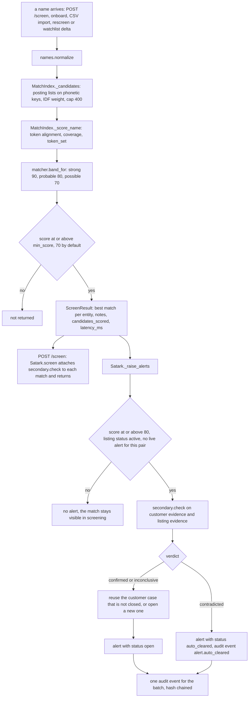
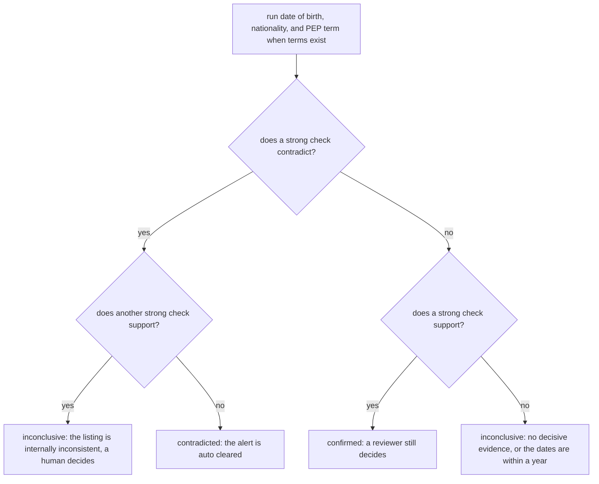
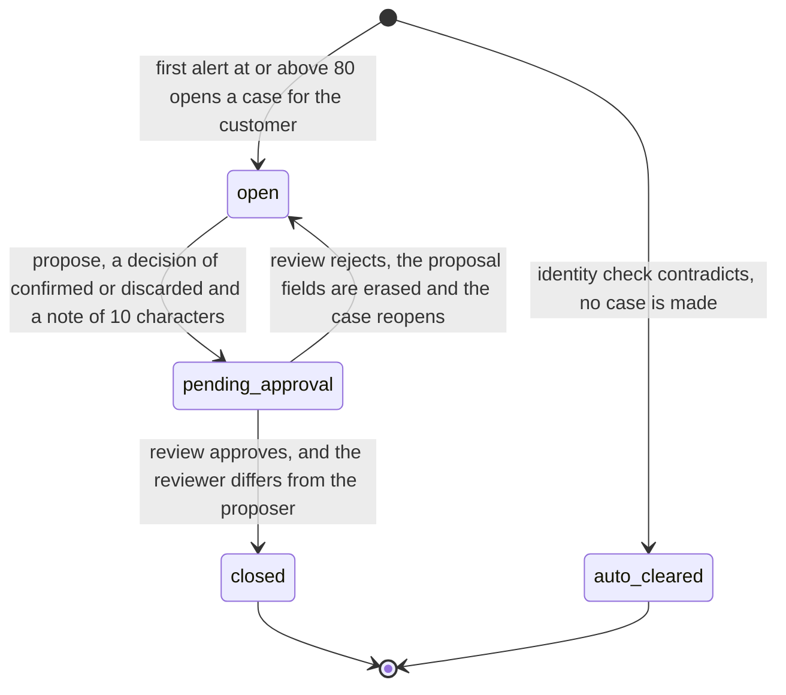
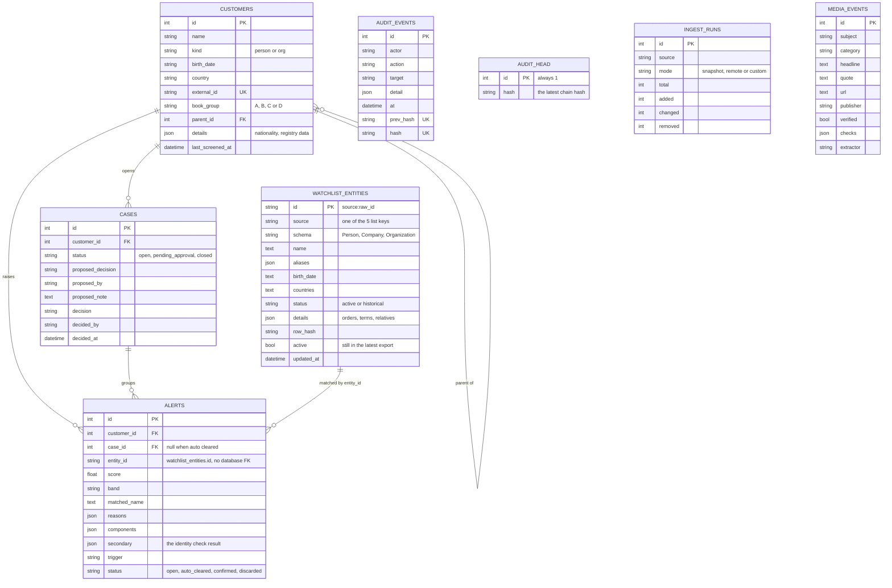
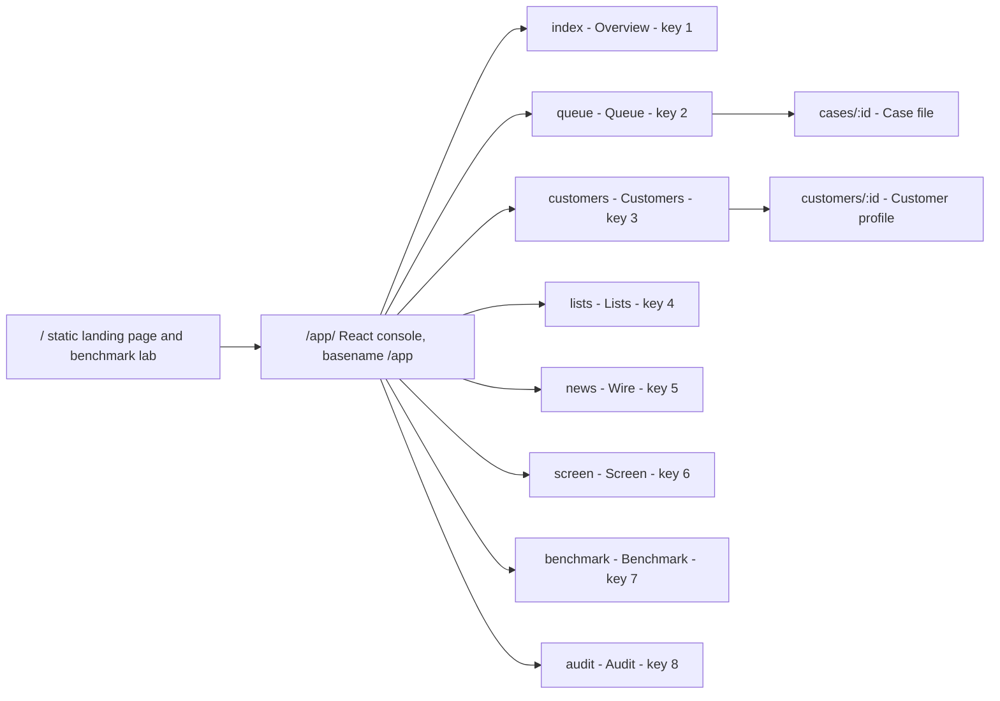

# Satark architecture

This document is a reader's map of the Satark codebase and of the path one name takes through it.

## 1. The shape of the system



The FastAPI app holds one `Satark` service object. That service owns the database session factory, the
in-memory `MatchIndex` and the event bus. The bus is Redis Streams when `SATARK_REDIS_URL` is set, and an
in-process bus otherwise, so the system runs with no Redis and no Postgres.

## 2. A name through the pipeline



The modules are `names.py` (`normalize`), `matcher.py` (`MatchIndex._candidates`,
`MatchIndex._score_name`, `MatchIndex.screen`, `band_for`), `secondary.py` (`check`) and `service.py`
(`Satark.screen`, `Satark._raise_alerts`, `Satark.audit`), all under `backend/satark/`. `POST /screen`
never raises an alert. Alerts come only from `_raise_alerts`, which `onboard`, `import_upload`,
`rescreen_all` and `handle_delta` call.

Two fields control the active-listing filter. `WatchlistEntity.active` is true while the entity is
still in the latest export, and only active rows enter the index. `WatchlistEntity.status` is `active`
or `historical`, and `sources.py` computes it from the sanction orders or the PEP terms. A historical
listing still appears in screening results, but `_raise_alerts` skips it.

## 3. The two checks

### 3.1 The name match

`names.normalize` prepares both the query and every listed name and alias. The steps, in order:

- Apply Unicode NFKC. Transliterate Devanagari with `devanagari_to_latin`, which maps consonants,
  matras, nukta forms, anusvara and visarga, and then deletes schwas. Remove diacritics.
- Cut a relation clause at `son of`, `daughter of`, `wife of`, `husband of`, `care of`, or at the
  markers `s/o`, `d/o`, `w/o`, `c/o`, `h/o`, `so`, `do`, `wo`.
- Decide the kind. A schema of `Person` gives `person`, `Organization` or `Company` gives `org`, and
  otherwise any token in `ORG_WORDS` gives `org`.
- Remove the firm prefix `M/s`. Expand dotted initials such as `a.b.c.`. For a person, split a bare
  consonant cluster of 2 to 3 capitals, such as `SKN`, into initials.
- Remove honorifics from `HONORIFICS`, and the leading honorifics `shri`, `shree`, `sri`, `sree`. For
  an org, remove the legal suffixes in `ORG_NOISE`, such as `ltd`, `pvt`, `llp`, `huf`.
- Canonicalise spellings with `CANONICAL`, for example every form of `mohammad`, and also `syed`,
  `shaikh`, `kumar`, `prasad`, `chandra`, `rao`. For a person, remove the Gujarati suffixes `-bhai`
  and `-ben` when at least 3 letters remain.
- Give each token a phonetic key through `phonetic_key`: the `PHONETIC_RULES` table, then remove `h`
  after a consonant, collapse repeats and drop a trailing `a`.

`MatchIndex` holds one entry per name variant: the primary name, the aliases and the text inside
parentheses. `_candidates` reads the posting lists for the query keys, adds near keys found by
Jaro-Winkler at 0.88 or above, weights each key by IDF, and keeps the top 400 by weight. A key whose
posting list is larger than `max_df` is skipped when a rarer key exists.

`_score_name` aligns tokens greedily by similarity. `token_similarity` returns 1.0 for an exact token,
0.94 for an equal phonetic key, 0.7 for an initial that prefixes the other token, and a spelling score
of `0.9 * min(jw, ratio + 0.05)` when the first letters agree, Jaro-Winkler is 0.88 or above, the
RapidFuzz ratio is 0.84 or above and both keys have at least 5 letters.

Each token carries the IDF weight `log((total + 1) / (df + 1)) + 1`. A name of 3 tokens or more gives
its middle tokens 0.6 of their weight, and an initial takes half the median vocabulary weight. Query
coverage and list coverage are the weighted shares that the alignment explains. The final score is
`100 * (0.85 * harmonic_mean(coverages) + 0.15 * token_set_ratio)`, and a kind mismatch multiplies it
by 0.85. `band_for` gives `strong` at 90, `probable` at 80, `possible` at 70 and `weak` below that.
The alert threshold is 80. On the held-out benchmark half the matcher reaches F1 0.953 against 0.572
for the RapidFuzz `token_sort_ratio` baseline, and `reports/eval.json` holds that run.

### 3.2 The identity check

`secondary.check` reads customer evidence (kind, birth date, nationality, country) and listing evidence
(birth date, countries, details) and runs up to three checks.

- **Date of birth**, strength strong. The same year and month supports. The same year with a different
  month is neutral, because a month slip is a common recording error. One year apart is neutral. Two or
  more years apart contradicts. An organisation, a missing customer date or a listing with no date
  gives `no_data`.
- **Nationality**, strength weak. A demonym is mapped through `DEMONYMS`, else the country code is
  used. A code among the listed countries supports, and one that is absent contradicts. A weak check
  never decides the verdict, because a listed country can mean jurisdiction.
- **PEP term of office**, strength strong, only when the listing carries terms. The earliest term start
  year minus the customer birth year gives an age. An age below `LOK_SABHA_MIN_AGE`, which is 25 under
  Article 84, contradicts.



Only `contradicted` changes the workflow. It writes an alert with status `auto_cleared` and no case,
and the alert keeps its evidence, so the clearance stays visible and auditable. A clearance holds only
while the listing is unchanged: `_raise_alerts` compares the clearance time with
`WatchlistEntity.updated_at` and screens the pair again after the list corrects the record.

## 4. Maker-checker and the audit chain



`auto_cleared` is an alert status, not a case status. The three case statuses in `models.Case` are
`open`, `pending_approval` and `closed`.

`Satark.propose` requires the actor role `analyst` or `reviewer`, a decision in `("confirmed",
"discarded")` and a note of at least 10 characters. `Satark.review` requires the role `reviewer` and
rejects an actor equal to `case.proposed_by`. That is the four-eyes rule. An approval closes the case
and writes the decision onto every open alert of that case. `ROLES` in `service.py` and the
`X-Satark-User` header are demo identities, not authentication.

Every state change writes one audit event. `service.audit_digest` builds the hash:

```python
stamp = at.astimezone(timezone.utc).isoformat(timespec="microseconds")
body = json.dumps([prev, actor, action, target, detail, stamp],
                  sort_keys=True, separators=(",", ":"), default=str)
digest = hashlib.sha256(body.encode()).hexdigest()
```

`prev` is the current head hash, and the genesis hash is 64 zeros. `Satark.audit` reads the head from
the single `audit_head` row, then moves it with a compare-and-set update on `WHERE id = 1 AND hash =
prev`. A concurrent writer updates 0 rows and gets an `AuditConflict`, which the API returns as 409,
so two processes cannot fork the chain.

`GET /audit/verify` calls `Satark.verify_audit`, which walks the events in id order and checks three
things: each `prev_hash` links to the previous hash, each recomputed digest equals the stored hash,
and the head equals the last hash. It returns `{"ok": true, "events": n, "head": h}`, or `{"ok":
false, "events": n, "broken_at": id, "reason": "..."}`. The Audit screen shows that result.

## 5. Data model

`backend/satark/models.py` holds all SQLAlchemy tables. `make_session_factory` creates the engine,
creates the tables and inserts the `audit_head` row when it is missing.



`Alert.entity_id` is a plain string column with an index. The code joins it to
`watchlist_entities.id`, but the schema declares no foreign key. The news articles are not in this
database. They live in `data/cache/news.db`, a separate SQLite file with an FTS5 index.

## 6. The frontend

`frontend/vite.config.ts` declares `appType: "mpa"` and two Rollup inputs. `frontend/index.html` is the
static landing page at `/`. `frontend/app/index.html` starts the React console under `/app/`. A small
Vite plugin rewrites `/app/...` deep links to the console HTML in development, and `ops/nginx.conf`
does the same in production. The dev server proxies `/api` to `http://127.0.0.1:8000`.



`frontend/src/components/satark/nav.ts` holds the eight function tabs, where the number is the
keyboard shortcut that `AppShell` binds outside text fields. `frontend/src/main.tsx` adds the two
detail routes and a catch-all, and loads every page lazily.

The eight screens: Overview shows live panels for the funnel, the score histogram, the identity
evidence, the group and list heatmap, the watchlists, the matching quality and the news. Queue lists
cases in the views open, awaiting review, closed and auto-cleared. Customers lists all 1,385 names
with group and kind facets, and holds the CSV import panel. Lists searches the 29,574 listings and
runs reverse screening. Wire is the news desk. Screen runs one name through both checks. Benchmark
shows the threshold sweep, the per-variant recall and the 34 labelled real cases. Audit verifies the
chain and lists events.

`DESIGN.md` at the repository root is the design system. `frontend/src/index.css` carries the Tailwind
v4 theme, where the `@theme inline` block maps every design token to a CSS variable, including the
band colours `strong`, `probable`, `possible` and `cleared`. The type is Archivo on its width axis for
words and Martian Mono for figures. `frontend/components.json` configures shadcn with the
`radix-nova` style and Lucide icons.

The landing page carries the benchmark lab. `frontend/landing/lab.js` holds five experiments:
`thresholdLab` draws the threshold sweep for Satark and the fuzzy baseline, `variantLab` shows the ten
name transforms, `identityLab` mirrors the date-of-birth rules of `secondary.py`, `bookLab` shows the
screening funnel and the real cases, and `tryName` calls `POST /screen` and uses recorded results when
the API is not running. `frontend/landing/lab.css` styles it in the same graphite world.

## 7. Folder structure

The tree below lists the version-controlled directories. Build output, caches and local tool state are
not listed, because `.gitignore` excludes them: `.venv`, `node_modules`, `frontend/dist`, `data/cache`,
`graphify-out`, `.claude`, `.claude-flow`, `.agents`, `.swarm` and `.impeccable`.

```
satark/
├── .github/
│   └── workflows/           ci.yml: pytest, the eval gate, the real-case gate, and the frontend build
├── backend/
│   ├── satark/              the Python package, installed as the satark command
│   │   └── media/           adverse media: extract.py, feeds.py, graph.py
│   ├── tests/               8 pytest modules and conftest.py, 122 tests
│   ├── Dockerfile           python:3.12-slim, copies data and reports, runs satark serve
│   └── pyproject.toml       dependencies, the satark entry point, pytest and ruff settings
├── data/
│   ├── book/                the committed book: group_a 840, group_b_companies 114, group_c 31 rows.
│   │                        The 400 group B officers are personal data and live in data/cache/
│   ├── eval/                real_cases.csv, the 34 labelled real pairs
│   └── snapshot/            the 5 watchlists as gzipped JSONL, 29,574 rows in total
├── docs/
│   ├── demo/                the walkthrough video and its README
│   │   └── stills/          51 numbered screenshots of the walkthrough
│   ├── screens/             6 screenshots used by the README
│   └── build-log.md         how the data, the matcher and the benchmark were built
├── frontend/
│   ├── app/                 index.html, the console entry point served under /app/
│   ├── landing/             lab.js and lab.css, the benchmark lab on the landing page
│   ├── public/
│   │   └── brand/           the wordmark, the mark and the icons
│   ├── src/
│   │   ├── components/      UI by area: benchmark, case, customer, lists, news, overview, satark,
│   │   │                    screen and ui, where satark holds the shell and ui holds shadcn parts
│   │   ├── lib/             api.ts, types.ts, format.ts, identity.tsx, utils.ts
│   │   └── pages/           the 8 screens plus case-file, customer-profile and not-found
│   ├── Dockerfile           node build, then nginx with ops/nginx.conf
│   ├── index.html           the static landing page at /
│   └── vite.config.ts       two entry points, the /app fallback and the /api proxy
├── loadtest/                locustfile.py, which posts names to /screen
├── ops/                     nginx.conf and prometheus.yml
├── reports/                 eval.json, the last benchmark report
├── DESIGN.md                the design system for the console and the landing page
├── PRODUCT.md               what the product does and who uses it
├── README.md                the entry point for a reader
├── Makefile                 every task below
├── docker-compose.yml       postgres, redis, api, worker, web and prometheus
└── .env.example             the environment variables, all commented out
```

## 8. Running it

### Make targets

| Target | What it does |
| --- | --- |
| `install` | Creates `.venv`, installs `backend[dev]` and runs `npm install` in `frontend`. |
| `seed` | Runs `satark seed`: loads the watchlists and the real book, then screens every customer. |
| `seed-synthetic` | Runs `satark seed --synthetic`: the Faker book with planted name variants. |
| `book` | Runs `satark book build`: rebuilds `data/book` from GLEIF and Companies House. |
| `news` | Runs `satark news poll`: reads the 10 feeds into the local news index. |
| `api` | Runs `satark serve --reload` on 127.0.0.1:8000. |
| `worker` | Runs `satark worker`: consumes the Redis delta stream and rescreens customers. |
| `web` | Runs `npm run dev` in `frontend` on port 5173. |
| `test` | Runs pytest in `backend`. |
| `eval` | Runs `satark eval --gate`: the benchmark with quality floors. |
| `eval-real` | Runs `satark eval --real --gate`: the 34 labelled real cases. |
| `load` | Runs Locust against the API, 50 users for 60 seconds. |
| `up` | Runs `docker compose up --build -d`. |
| `seed-docker` | Runs `satark seed` inside the running `api` container. |
| `down` | Runs `docker compose down`. |
| `mcp-config` | Prints the MCP server JSON block for a client configuration file. |

### Environment variables

`backend/satark/config.py` reads these through pydantic-settings, with the prefix `SATARK_` and an
optional `.env` file.

| Variable | Default | Use |
| --- | --- | --- |
| `SATARK_DATABASE_URL` | `sqlite:///satark.db` at the repository root | The SQLAlchemy URL. |
| `SATARK_REDIS_URL` | empty | Empty means the in-process bus, so the API rescreens inline. |
| `SATARK_DATA_DIR` | `data` | Where the snapshots, the book, the eval cases and `cache/news.db` live. |
| `SATARK_REPORTS_DIR` | `reports` | Where `satark eval` writes `eval.json`. |
| `SATARK_ALERT_THRESHOLD` | `80.0` | The score at which a match raises an alert. |
| `SATARK_MIN_SCORE` | `70.0` | The lowest score a screening result returns. |
| `SATARK_ANTHROPIC_API_KEY` or `ANTHROPIC_API_KEY` | empty | Empty means keyword rules extract adverse media. |
| `SATARK_LLM_MODEL` | `claude-haiku-4-5` | The model used for media extraction. |
| `SATARK_COMPANIES_HOUSE_KEY` | empty | Only needed to rebuild group B of the book. |
| `SATARK_CORS_ORIGINS` | the two localhost:5173 origins | A comma-separated allowlist. |
| `SATARK_MEDIA_MAX_ITEMS` | `12` | The headline limit for one media brief. |
| `SATARK_API` | `http://127.0.0.1:8000` | Read by `frontend/vite.config.ts` for the `/api` proxy. |

### Docker compose services

| Service | Image or build | Notes |
| --- | --- | --- |
| `postgres` | `postgres:16-alpine` | Database `satark`, with the `pgdata` volume and a `pg_isready` health check. |
| `redis` | `redis:7-alpine` | The delta stream, with a `redis-cli ping` health check. |
| `api` | `backend/Dockerfile` | Port 8000, waits for both health checks, and has its own health check on `/health`. |
| `worker` | `backend/Dockerfile` | Runs `satark worker --metrics-port 9101` and waits for a healthy api. |
| `web` | `frontend/Dockerfile` | nginx on port 5173, which proxies `/api/` to the api service. |
| `prometheus` | `prom/prometheus:v2.55.1` | Port 9090, in the `observability` profile, scraping api and worker. |

The API exposes `/health` and `/metrics`. `backend/satark/metrics.py` defines the screening latency
histogram, the screening, alert, decision and delta counters, the active-entity gauge and the media
counter. `satark eval --gate` fails when precision falls below 0.93, recall below 0.90 or F1 below
0.92, and CI runs both gates on every push and pull request.
